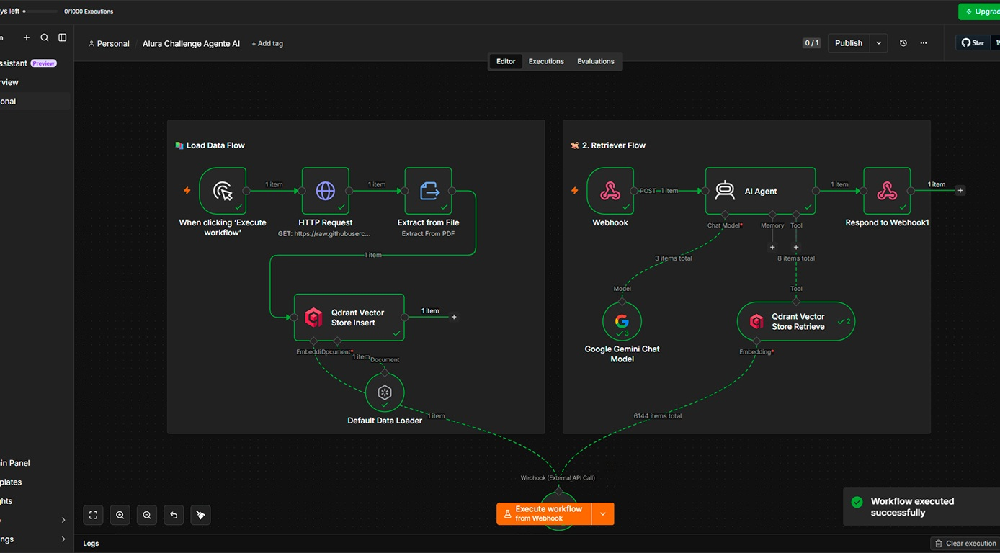
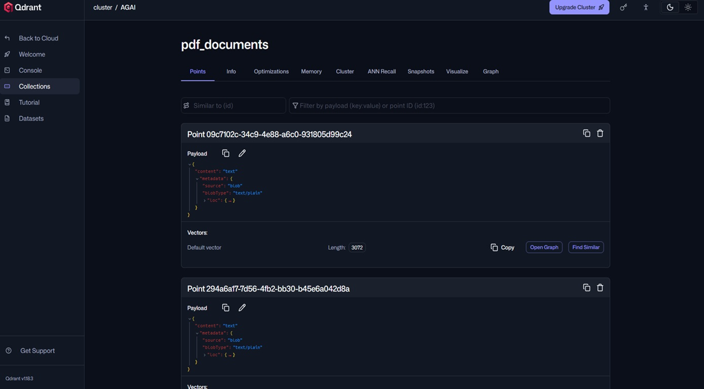

# 🤖 Agente IA Veterinario - Chat con documentos usando n8n + Qdrant + Google Gemini

Proyecto desarrollado como implementación de un agente de inteligencia artificial capaz de responder preguntas utilizando información almacenada en documentos mediante una arquitectura **RAG (Retrieval Augmented Generation)**.

El agente IA está especializado en brindar información relacionada con la salud de los gatos, permitiendo consultar documentos veterinarios para responder preguntas sobre:

- Enfermedades frecuentes en gatos.
- Síntomas asociados a diferentes padecimientos.
- Recomendaciones y acciones preventivas.
- Información veterinaria almacenada en documentos de conocimiento.

El sistema utiliza recuperación aumentada por generación (**RAG**) para buscar información relevante dentro de una base de conocimiento y generar respuestas utilizando inteligencia artificial.

La solución integra:

- Interfaz web desplegada en GitHub Pages.
- Comunicación mediante Webhook con n8n.
- Agente IA utilizando Google Gemini.
- Base vectorial Qdrant para recuperación semántica de información.
- Documentos veterinarios indexados para consultas inteligentes.

---

# 🚀 Chat del Agente IA

Puedes acceder directamente al asistente desde el siguiente enlace:

👉 [Abrir Agente IA - Chat](https://bystcarvajal.github.io/challenge-alura-agente-ai/agt-chat/)

---

# 🐈 Descripción general del proyecto

Este proyecto consiste en la implementación de un agente conversacional basado en inteligencia artificial que permite realizar consultas sobre enfermedades y problemas de salud en gatos.

El usuario puede realizar preguntas utilizando lenguaje natural, por ejemplo:

- ¿Qué puedo hacer si mi gato tiene bolas de pelo?
- ¿Cuáles son los síntomas de problemas urinarios?
- ¿Cómo prevenir los parásitos en gatos?

El agente procesa la consulta, recupera información relevante desde documentos veterinarios almacenados en una base de datos vectorial y genera una respuesta utilizando un modelo de lenguaje.

El objetivo principal es crear un asistente inteligente que facilite el acceso a información veterinaria organizada, utilizando tecnologías modernas de inteligencia artificial generativa.

---

# 🏗️ Arquitectura de la solución implementada

La solución está basada en una arquitectura **RAG (Retrieval Augmented Generation)**, donde la inteligencia artificial combina un modelo generativo con una base de conocimiento externa.

El flujo general del sistema es:

```
Usuario
   |
   |
GitHub Pages
(Chat Web)
   |
   |
Solicitud HTTP POST
(Webhook)
   |
   |
n8n Cloud
   |
   |
Agente IA
   |
   |
Qdrant Vector Database
(Búsqueda semántica)
   |
   |
Google Gemini
(Generación de respuesta)
   |
   |
Respuesta al usuario
```

## Funcionamiento del flujo:

1. El usuario realiza una pregunta desde la interfaz web.
2. El frontend envía la consulta mediante un Webhook hacia n8n.
3. n8n recibe la pregunta y activa el flujo del agente IA.
4. El agente consulta Qdrant para encontrar información relacionada dentro de los documentos almacenados.
5. Google Gemini analiza el contexto recuperado y genera una respuesta basada en la información encontrada.
6. La respuesta es enviada nuevamente al usuario.

---

# 🔧 Tecnologías y herramientas utilizadas

## Frontend

- HTML5
- CSS3
- JavaScript
- GitHub Pages

## Automatización e Inteligencia Artificial

- n8n Cloud
- Webhooks
- Agente IA
- Google Gemini

## Base de conocimiento

- Qdrant Vector Database
- Embeddings
- Arquitectura RAG (Retrieval Augmented Generation)

---

# 📡 Comunicación con n8n

El frontend envía las preguntas mediante una petición HTTP POST:

```json
[
  {
    "question": "Pregunta del usuario"
  }
]
```

El agente procesa la consulta y devuelve:

```json
[
  {
    "output": "Respuesta generada por la IA"
  }
]
```

---

# 💬 Ejemplos de interacción con el Agente IA

## Ejemplo 1

### Pregunta del usuario:

```
Mi gato vomita bolas de pelo frecuentemente, ¿debo preocuparme?
```

### Respuesta generada por el agente:

```
Los gatos eliminan normalmente el pelo ingerido durante el acicalamiento mediante la materia fecal y, en ocasiones, mediante el vómito.

Sin embargo, si un gato vomita bolas de pelo más de 1 o 2 veces al año, puede existir otro problema asociado y se recomienda iniciar un proceso diagnóstico con un veterinario.

Para prevenir la formación de bolas de pelo se recomienda cepillar frecuentemente al gato para disminuir la cantidad de pelo que ingiere.
```

---

## Ejemplo 2

### Pregunta del usuario:

```
¿Cómo puedo saber si mi gato tiene piedras en la vejiga?
```

### Respuesta generada por el agente:

```
Los cálculos urinarios en gatos pueden causar molestias y algunos signos como orinar con sangre, realizar micciones en lugares inadecuados o producir pequeñas cantidades de orina muchas veces.

Para ayudar a disminuir la aparición de estos problemas se recomienda fomentar el consumo de agua mediante fuentes o colocando varios recipientes con agua fresca disponibles.

También es importante ofrecer un alimento de buena calidad y balanceado que ayude a controlar el pH urinario.
```

---

## Ejemplo 3

### Pregunta del usuario:

```
¿Cómo puedo prevenir que mi gato tenga parásitos?
```

### Respuesta generada por el agente:

```
Para prevenir los parásitos en gatos es importante evitar la exposición a ambientes contaminados y el contacto con animales infectados.

Los gatos pueden presentar parásitos externos como pulgas, ácaros y garrapatas, además de parásitos internos como los gastrointestinales.

Se recomienda realizar desparasitaciones periódicas para evitar el aumento de la carga parasitaria y reducir la aparición de signos asociados a la enfermedad.
```

---

# 📸 Evidencias del proyecto

## Flujo del agente IA en n8n




## Base vectorial Qdrant



---


# 🎯 Objetivo del proyecto

Implementar un asistente virtual basado en inteligencia artificial capaz de consultar información contenida en documentos veterinarios, utilizando técnicas modernas de recuperación aumentada por generación (**RAG**) y herramientas de automatización.

El proyecto demuestra la integración de:

- Interfaces web.
- Automatización mediante n8n.
- Modelos de inteligencia artificial generativa.
- Bases de datos vectoriales.
- Sistemas inteligentes de consulta documental.

---

# 👨‍💻 Autor

**bystcarvajal**

Proyecto desarrollado como parte del desafío de implementación de agentes de inteligencia artificial.
